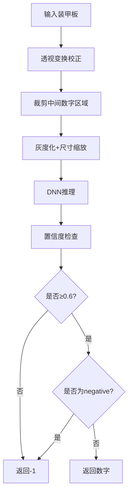
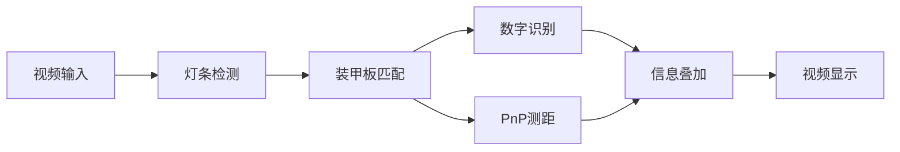

## ✅ 一、文件概述
- **文件名**：`LightBarDetector.cpp`
- **所属类**：`LightBarDetector`
- **功能**：实现视觉灯条检测，用于机器人视觉系统（如RoboMaster比赛中装甲板灯条的检测）
- **核心输出**：一组符合灯条几何特征的旋转矩形（`cv::RotatedRect`）

---

## ✅ 二、函数参数解析

### 1. `LightBarDetector::LightBarDetector()`
- **功能**：构造函数
- **参数**：无
- **内部操作**：初始化 `enemyColor` 为 `1`（默认敌方颜色为红色）

---

### 2. `void LightBarDetector::setEnemyColor(int color)`
- **功能**：设置敌方颜色，用于后续颜色分离
- **参数**：
  - `color`：0 表示蓝色，1 表示红色
- **作用**：动态切换检测目标颜色，适应比赛中的红蓝方切换

---

### 3. `std::vector<cv::RotatedRect> LightBarDetector::detect(const cv::Mat& frame)`
- **功能**：灯条检测主函数
- **输入**：
  - `frame`：输入的 BGR 彩色图像（OpenCV 默认格式）
- **输出**：
  - `std::vector<cv::RotatedRect>`：检测到的灯条旋转矩形集合

---

## ✅ 三、函数逻辑梳理（五步法）

### **第1步：颜色分离增强**
```cpp
cv::subtract(channels[2], channels[0], gray);  // 红减蓝
// 或
cv::subtract(channels[0], channels[2], gray);  // 蓝减红
```
- 根据敌方颜色选择通道相减，增强灯条与背景的对比度

### **第2步：二值化**
```cpp
cv::threshold(gray, binary, 0, 255, cv::THRESH_BINARY | cv::THRESH_OTSU);
```
- 使用 **OTSU自适应阈值**，自动适应光照变化

### **第3步：形态学处理**
```cpp
cv::morphologyEx(binary, binary, cv::MORPH_DILATE, kernel);
```
- 使用矩形核 `(3,5)` 膨胀，连接断裂的灯条区域

### **第4步：轮廓提取**
```cpp
cv::findContours(binary, contours, cv::RETR_EXTERNAL, cv::CHAIN_APPROX_SIMPLE);
```
- 仅提取外部轮廓，简化轮廓点

### **第5步：几何特征筛选**
1. 轮廓点数过滤（>6）
2. 转换为旋转矩形
3. **规范化**：确保宽度为短边，高度为长边
4. 筛选条件：
   - 面积 > 20
   - 长宽比在 1.5 ~ 12 之间
   - 倾斜角度不超过 45 度（或不在 45°~135° 之间）

---

## ✅ 四、所用方法优点

| 步骤 | 方法 | 优点 |
|------|------|------|
| 颜色分离 | 通道相减 | 增强目标颜色对比度，减少背景干扰 |
| 二值化 | OTSU自适应阈值 | 无需手动调参，适应不同光照环境 |
| 形态学 | 膨胀操作 | 填补灯条断裂，增强连通性 |
| 轮廓提取 | `RETR_EXTERNAL` | 只提取最外层轮廓，减少计算量 |
| 几何筛选 | 面积、长宽比、角度 | 有效过滤非灯条物体，提高检测准确率 |

---

## ✅ 五、OpenCV 方法简介

| 函数 | 作用 |
|------|------|
| `cv::split()` | 分离 BGR 三通道图像 |
| `cv::subtract()` | 图像相减，用于颜色增强 |
| `cv::threshold()` | 二值化，OTSU 模式自适应阈值 |
| `cv::getStructuringElement()` | 创建形态学操作的核 |
| `cv::morphologyEx()` | 形态学操作（膨胀/腐蚀/开闭运算） |
| `cv::findContours()` | 提取图像中的轮廓 |
| `cv::minAreaRect()` | 计算轮廓的最小外接旋转矩形 |

---

## ✅ 六、代码整体作用
- 用于机器人视觉系统中的 **灯条检测**，是装甲板识别的第一步
- 通过颜色分离、形态学处理、几何特征筛选，从复杂背景中提取出灯条区域
- 输出为旋转矩形，便于后续匹配成装甲板对

---


## ✅ 一、文件概述
- **文件名**：`ArmorMatcher.cpp`
- **所属类**：`ArmorMatcher`
- **功能**：将检测到的灯条配对成装甲板，进行装甲板类型识别（大小装甲板区分）
- **核心输出**：一组有效的装甲板（`Armor` 结构体）

---

## ✅ 二、函数参数解析

### 1. `ArmorMatcher::ArmorMatcher()`
- **功能**：构造函数
- **参数**：无
- **内部操作**：初始化空对象

---

### 2. `bool ArmorMatcher::isValidPair(const cv::RotatedRect& l1, const cv::RotatedRect& l2)`
- **功能**：判断两个灯条是否构成有效的装甲板对
- **参数**：
  - `l1, l2`：两个灯条的旋转矩形
- **返回值**：`true` 表示有效，`false` 表示无效
- **筛选条件**：
  1. 角度差异 ≤ 10°
  2. 高度比例在 0.6 ~ 1.66 之间
  3. 垂直位置偏移不超过平均高度的 0.5 倍

---

### 3. `std::vector<Armor> ArmorMatcher::match(const std::vector<cv::RotatedRect>& lights)`
- **功能**：装甲板匹配主函数
- **输入**：
  - `lights`：`LightBarDetector` 检测到的灯条矩形集合
- **输出**：
  - `std::vector<Armor>`：匹配成功的装甲板集合

---

## ✅ 三、函数逻辑梳理

### **第1步：基本检查**
- 灯条数量少于2时直接返回空

### **第2步：双重循环配对**
- 遍历所有灯条组合 `(i, j)`
- 调用 `isValidPair()` 进行初步筛选

### **第3步：装甲板类型判断**
```cpp
float ratio = dist / avgH;  // 灯条间距 / 灯条平均高度
if (ratio > 1.8 && ratio < 3.2) type = ArmorType::SMALL;
else if (ratio >= 3.2 && ratio < 5.5) type = ArmorType::LARGE;
```
- **小装甲板**：比例 1.8~3.2
- **大装甲板**：比例 3.2~5.5

### **第4步：评分机制**
```cpp
float score = (1.0 - angleDiff / 15.0) + (1.0 - yDiff / avgH);
```
- 角度差异越小，分数越高
- 垂直对齐越好，分数越高

### **第5步：装甲板区域构建**
- 获取两个灯条的4个顶点
- 合并所有顶点计算最小外接矩形
- 保存装甲板的矩形区域和边界框

### **第6步：去重处理**
- 按评分降序排序
- 使用 `used` 数组避免重复匹配
- 只保留每个灯条的最佳匹配

---

## ✅ 四、装甲板类型区分

| 装甲板类型 | 比例范围 | 实际特征 |
|------------|----------|----------|
| 小装甲板 | 1.8 ~ 3.2 | 通常是数字 1-4 |
| 大装甲板 | 3.2 ~ 5.5 |  |

> **注意**：比例范围基于实际机器人比赛（如 RoboMaster）的装甲板尺寸设计

---

## ✅ 五、所用方法优点

| 步骤 | 方法 | 优点 |
|------|------|------|
| 角度一致性 | 角度差 ≤ 10° | 确保两灯条平行 |
| 高度比例 | 0.6 ~ 1.66 | 容忍透视变形和检测误差 |
| 垂直对齐 | y 差 ≤ 0.5H | 确保两灯条在同一水平线 |
| 大小分类 | 比例判断 | 区分大小装甲板，优化后续数字识别 |
| 评分排序 | 综合评分 | 优先选择最佳匹配 |
| 去重机制 | used 数组 | 避免一个灯条匹配多个装甲板 |

---

## ✅ 六、OpenCV 方法简介

| 函数 | 作用 |
|------|------|
| `cv::norm()` | 计算两点间的欧氏距离 |
| `cv::minAreaRect()` | 计算点集的最小外接旋转矩形 |
| `cv::RotatedRect::points()` | 获取旋转矩形的四个顶点 |
| `cv::RotatedRect::boundingRect()` | 获取旋转矩形的正外接矩形（非旋转） |

---

## ✅ 七、代码整体作用
- 将孤立的灯条**配对**成完整的装甲板
- **区分大小装甲板**，为后续数字识别优化处理
- 提供装甲板的**几何信息**（位置、大小、角度），用于 PnP 解算
- 通过评分和去重机制**提高匹配质量**

---
以下是 `NumberRecognizer.cpp` 文件的详细解析：

---

## ✅ 一、文件概述
- **文件名**：`NumberRecognizer.cpp`
- **所属类**：`NumberRecognizer`
- **功能**：对装甲板进行数字识别，判断装甲板编号（1-5,7）
- **核心技术**：基于 OpenCV DNN 模块的深度学习推理
- **输入输出**：
  - **输入**：原始图像 + 装甲板区域
  - **输出**：识别到的数字（-1 表示识别失败）

---

## ✅ 二、函数参数解析

### 1. `NumberRecognizer::NumberRecognizer()`
- **功能**：构造函数
- **参数**：无
- **内部操作**：初始化类别标签（与训练时的标签顺序一致）
  ```cpp
  classNames = {"1", "2", "3", "4", "5", "7", "negative"};
  ```

---

### 2. `bool NumberRecognizer::init(const std::string& modelPath)`
- **功能**：加载训练好的 ONNX 模型
- **参数**：
  - `modelPath`：ONNX 模型文件路径
- **返回值**：加载成功返回 `true`，失败返回 `false`
- **设备选择**：
  - 优先 CUDA GPU
  - 其次 CPU（OpenCV 后端）

---

### 3. `void NumberRecognizer::sortPoints(cv::Point2f pts[4])`
- **功能**：将装甲板四个顶点排序为透视变换的标准顺序
- **参数**：
  - `pts`：输入的4个无序顶点
- **输出**：排序后的顶点（TL, TR, BR, BL）

---

### 4. `int NumberRecognizer::recognize(const cv::Mat& frame, const Armor& armor)`
- **功能**：数字识别主函数
- **参数**：
  - `frame`：原始图像
  - `armor`：装甲板信息（包含四个顶点）
- **返回值**：
  - 识别到的数字（1-5,7）
  - -1：识别失败或非数字
- **置信度阈值**：0.6

---

## ✅ 三、函数逻辑梳理（六步法）

### **第1步：透视变换提取装甲板**
```cpp
// 顶点排序 → 计算透视变换矩阵 → 变换到固定尺寸
cv::Mat M = cv::getPerspectiveTransform(srcPts, dstPts);
cv::warpPerspective(frame, warped, M, cv::Size(50, 50));
```
- 将倾斜的装甲板**校正**为正方形
- 固定输出尺寸：50×50

### **第2步：裁剪数字区域**
```cpp
cv::Rect cropRoi(15, 0, 20, 50);  // 裁剪中间数字部分
cv::Mat numberROI = warped(cropRoi);
```
- **重要假设**：数字位于装甲板中央（宽度约20像素）
- 去除两侧灯条干扰

### **第3步：图像预处理**
```cpp
cv::cvtColor(warped, warped, cv::COLOR_BGR2GRAY);  // 转灰度
cv::dnn::blobFromImage(numberROI, blob, 1.0/255.0, cv::Size(20, 40), ...);
```
1. **色彩转换**：BGR → 灰度（单通道）
2. **归一化**：像素值从 0-255 缩放到 0-1
3. **缩放**：调整到网络输入尺寸（20×40）

### **第4步：神经网络推理**
```cpp
net.setInput(blob);
cv::Mat prob = net.forward();
```
- 前向传播获取概率分布

### **第5步：结果解析**
```cpp
cv::minMaxLoc(prob, NULL, &maxVal, NULL, &maxLoc);
int classId = maxLoc.x;  // 获取最大概率索引
```
- 找到概率最大的类别

### **第6步：过滤与返回**
1. **置信度过滤**：`maxVal < 0.6` → 返回 -1
2. **负样本过滤**：识别为 "negative" → 返回 -1
3. **数字转换**：字符串转整数

---

## ✅ 四、数字识别流程可视化



---

## ✅ 五、所用方法优点

| 步骤 | 技术 | 优点 |
|------|------|------|
| 顶点排序 | 几何排序算法 | 确保透视变换顺序正确 |
| 透视变换 | `warpPerspective` | 消除透视畸变，提高识别率 |
| 裁剪区域 | ROI 裁剪 | 排除灯条干扰，专注数字 |
| 预处理 | 灰度化+归一化 | 与训练时保持一致，确保推理准确 |
| 推理后端 | 自动选择GPU/CPU | 最大化运行效率 |
| 过滤机制 | 双阈值过滤 | 提高识别可靠性，减少误判 |

---

## ✅ 六、OpenCV 方法简介

| 函数 | 作用 |
|------|------|
| `cv::dnn::readNetFromONNX()` | 加载 ONNX 格式的深度学习模型 |
| `net.setPreferableBackend/Target()` | 设置推理后端和目标设备 |
| `cv::getPerspectiveTransform()` | 计算透视变换矩阵 |
| `cv::warpPerspective()` | 应用透视变换 |
| `cv::dnn::blobFromImage()` | 将图像转换为网络输入格式 |
| `net.setInput()` / `net.forward()` | 设置输入并执行推理 |
| `cv::minMaxLoc()` | 查找矩阵中的最大值及其位置 |
| `cv::cvtColor()` | 颜色空间转换 |

---


## ✅ 七、训练数据与模型注意事项

1. **标签顺序必须一致**：
   ```cpp
   // C++代码顺序必须与训练时Python代码的标签顺序一致
   classNames = {"1", "2", "3", "4", "5", "7", "negative"};
   ```

2. **预处理一致性**：
   - 训练时：`Resize((40, 20))`（高40，宽20）
   - 推理时：`cv::Size(20, 40)`（宽20，高40）

3. **归一化处理**：
   - Python：`ToTensor()`（0-255 → 0.0-1.0）
   - C++：`1.0/255.0`

---

## ✅ 八、整体作用
- **核心任务**：将视觉检测的装甲板**赋予语义信息**（数字编号）
- **关键技术**：深度学习 + 传统图像处理
- **实际应用**：在机器人对抗赛中，识别敌方机器人编号，实现**精准打击**

---

## ✅ 一、文件概述
- **文件名**：`AutoAimSystem.cpp`
- **所属类**：`AutoAimSystem`
- **功能**：**视觉自动瞄准系统的主控模块**，整合灯条检测、装甲板匹配、数字识别、距离解算等所有功能
- **系统流程**：完整的机器人视觉瞄准 pipeline
- **输出**：带有识别信息标注的视频显示

---

## ✅ 二、函数参数解析

### 1. `AutoAimSystem::AutoAimSystem()`
- **功能**：构造函数，系统初始化
- **参数**：无
- **内部操作**：
  - 设置敌方颜色（默认红色）
  - **加载数字识别模型**
  - 初始化相机参数（内参和畸变系数）

---

### 2. `void AutoAimSystem::initCameraParams()`
- **功能**：初始化相机内参和畸变系数
- **参数**：无
- **当前实现**：使用**估计值**（1280×720分辨率）
  ```cpp
  fx = fy = 1000.0  // 焦距
  cx = 640.0        // 图像中心x
  cy = 360.0        // 图像中心y
  ```
> **注意**：实际应用中需要通过相机标定获取精确参数

---

### 3. `void AutoAimSystem::solvePnP(Armor& armor)`
- **功能**：使用 PnP 算法解算装甲板**三维位置和距离**
- **参数**：
  - `armor`：装甲板对象（输入输出参数）
- **输出**：更新 `armor.distance`（Z轴距离，单位mm）

---

### 4. `void AutoAimSystem::run(const std::string& videoPath)`
- **功能**：系统主循环，处理视频流
- **参数**：
  - `videoPath`：视频文件路径或摄像头索引
- **处理流程**：检测→匹配→识别→测距→显示

---

## ✅ 三、函数逻辑梳理（完整流水线）



### **第1步：系统初始化**
1. 加载数字识别模型（ONNX格式）
2. 设置相机参数（硬编码）
3. 配置敌方颜色

### **第2步：视频流处理**
```cpp
cv::VideoCapture cap(videoPath);
while (cap.read(frame)) {
    // 处理每一帧
}
```

### **第3步：检测与匹配**
```cpp
// 调用之前模块的功能
lights = detector.detect(frame);      // 灯条检测
armors = matcher.match(lights);      // 装甲板匹配
```

### **第4步：数字识别与距离解算**
```cpp
for (auto& armor : armors) {
    number = recognizer.recognize(frame, armor);  // 数字识别
    solvePnP(armor);                              // PnP测距
}
```

### **第5步：信息叠加显示**
```cpp
// 绘制装甲板边框
cv::line(frame, points[i], points[(i+1)%4], ...);

// 显示识别信息
cv::putText(frame, "Num: X", ...);    // 数字
cv::putText(frame, "Dist: Xmm", ...); // 距离
cv::putText(frame, "Type: X", ...);   // 大小类型
```

---

## ✅ 四、PnP算法详解

### **世界坐标定义**
| 装甲板类型 | 宽度(mm) | 高度(mm) |
|------------|----------|----------|
| 小装甲板 | 135 | 55 |
| 大装甲板 | 230 | 55 |

### **坐标点顺序**
```
世界坐标点顺序（与图像点必须一致）：
TL(-w/2, -h/2) —— TR(w/2, -h/2)
   |                        |
BL(-w/2, h/2) —— BR(w/2, h/2)
```

### **图像点排序逻辑**
```cpp
// 原始点集 → X排序 → 区分左右 → 区分上下 → 重新排列
// 最终顺序：TL, TR, BR, BL（与世界坐标对应）
```

---

## ✅ 五、所用方法优点

| 模块 | 优点 |
|------|------|
| **系统集成** | 模块化设计，各组件解耦 |
| **PnP测距** | 提供精确的3D位置信息，用于弹道补偿 |
| **信息显示** | 实时可视化所有识别结果，便于调试 |
| **错误处理** | 模型加载失败有明确提示 |
| **设备兼容** | 自动选择GPU/CPU推理 |

---

## ✅ 六、OpenCV 方法简介

| 函数 | 作用 |
|------|------|
| `cv::VideoCapture()` | 打开视频文件或摄像头 |
| `cap.read()` / `cap >> frame` | 读取视频帧 |
| `cv::solvePnP()` | 求解3D-2D点对应关系（PnP问题） |
| `cv::line()` | 绘制直线（用于绘制装甲板边框） |
| `cv::putText()` | 在图像上绘制文字（显示识别信息） |
| `cv::imshow()` | 显示图像窗口 |
| `cv::waitKey()` | 等待按键，ESC(27)退出 |

---

## ✅ 七、装甲板3D信息输出
```cpp
// 输出到装甲板对象的信息：
armor.type        // 大小类型（SMALL/LARGE）
armor.number      // 数字编号（1-5,7 或 -1）
armor.distance    // 距离（mm，Z轴坐标）
armor.points[4]   // 图像中四个顶点坐标
armor.rect        // 旋转矩形区域
```

---

## ✅ 八、与项目其他模块的关系

```
AutoAimSystem（主控制器）
    ├── LightBarDetector（灯条检测）
    ├── ArmorMatcher（装甲板匹配）
    ├── NumberRecognizer（数字识别）
    └── PnP解算模块
```

- **协调作用**：调度所有子模块按正确顺序执行
- **数据流**：帧图像 → 灯条 → 装甲板 → 数字+距离
- **最终输出**：带有完整信息的可视化结果


